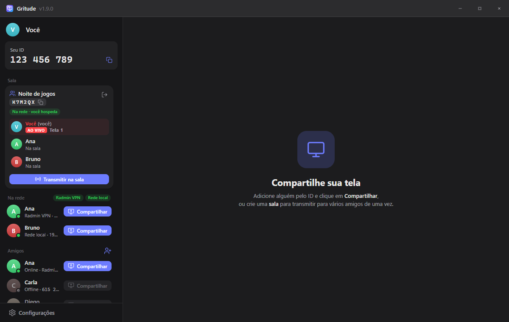

  

<h1 align="center">Gritude</h1>

  Compartilhe a tela com seus amigos pela <strong>rede local</strong>, pelo <strong>Radmin VPN</strong> ou <strong>pela internet</strong>, 
  com áudio do PC, direto de um computador para o outro.

  
  
  
  

  

---

## Sumário

- [O que é](#o-que-é)
- [Recursos](#recursos)
- [Download e instalação](#download-e-instalação)
- [Primeiros passos](#primeiros-passos)
  - [Mesma rede (casa, Wi-Fi ou cabo)](#mesma-rede-casa-wi-fi-ou-cabo)
  - [Pela internet com o Radmin VPN](#pela-internet-com-o-radmin-vpn)
  - [Pela internet, só com o ID](#pela-internet-só-com-o-id)
  - [Código de convite](#código-de-convite)
- [Como usar](#como-usar)
- [Qualidade e áudio](#qualidade-e-áudio)
- [Atalhos](#atalhos)
- [Privacidade](#privacidade)
- [Atualizações](#atualizações)
- [Problemas comuns](#problemas-comuns)

---

## O que é

O **Gritude** é um app para Windows que transmite a sua tela (ou uma janela) para outras pessoas que também estão com ele aberto. O vídeo e o som vão **direto de um PC para o outro**: não existe cadastro nem servidor do Gritude no meio.

Ele acha seus amigos de três jeitos:

- na **mesma casa** (mesmo Wi-Fi ou cabo): aparecem sozinhos;
- à distância, numa **rede virtual** como o [Radmin VPN](https://www.radmin-vpn.com/br/) ou o Hamachi: também aparecem sozinhos;
- **pela internet, só com o ID** de 9 dígitos, sem instalar mais nada. Se não der certo, há o **código de convite**, que vocês trocam pelo chat do Discord.

Funciona também com quem usa a versão completa do Gritude.

## Recursos

| | |
|---|---|
| 🖥️ **Tela ou janela** | Transmita a tela inteira ou só uma janela, escolhendo pela miniatura. |
| 🔊 **Som do PC** | Áudio em estéreo junto com o vídeo. Dá para tirar o som do Discord (sem eco na call) ou mandar só o som da janela transmitida. |
| 🎚️ **Qualidade ajustável** | Até 1440p ou resolução original, de 15 a 60 FPS. No modo automático usa a placa de vídeo para codificar. |
| 🔁 **Trocar sem cair** | Troque de tela, janela ou qualidade sem derrubar quem está assistindo. |
| 👥 **Salas** | Crie uma sala: todo mundo da rede vê e entra com um clique, e qualquer um pode transmitir. Chame amigos de fora da rede também. |
| 🌐 **Pela internet sem servidor** | Adicione um amigo pelo ID e o Gritude o acha pela internet, mesmo fora da sua rede e sem Radmin. |
| 🔗 **Código de convite** | Plano B para quando vocês não se acham: um manda o convite pelo chat, o outro cola a resposta. |
| 🌳 **Repasse P2P** | Quem assiste pode repassar a imagem para outras pessoas da mesma transmissão, então você não precisa mandar para todo mundo sozinho. |
| 🧑‍🤝‍🧑 **Amigos** | Adicione pelo ID de 9 dígitos ou pelo **@ do Discord**. A pessoa recebe um pedido de amizade e aceita ou recusa. |
| 🖼️ **Perfil** | Escolha nome e foto, ou use os do Discord. Seus amigos veem os dois. |
| 💬 **Conectar com Discord** | Opcional: entre com sua conta do Discord, sem servidor, para usar seu nome e foto de lá e ser achado pelo seu @. |
| 🌗 **Modo claro e escuro** | Troque no botão ao lado do seu nome. |
| 📺 **Várias telas ao mesmo tempo** | Assista mais de uma pessoa, em grade, destaque ou lado a lado. Se você também está transmitindo, sua tela vira uma miniatura no canto. |
| 🪟 **Modo PIP** | Um mini-player sempre por cima das outras janelas, que você arrasta e deixa transparente. |
| 📌 **Fixar na chamada do Discord** | Prende o vídeo em cima da área da chamada do Discord, como o compartilhamento de tela de lá. |
| 🟣 **Status no Discord** | Opcional: seu perfil do Discord mostra quando você está transmitindo ou assistindo. |
| ➕ **Convidar pelo Discord** | Numa sala, o **+** do chat do Discord mostra *Convidar para Gritude*. Quem aceita entra na sala, mesmo fora da sua rede. |

## Download e instalação

1. Abra a página da **[última versão](https://github.com/mattmachad/Gritude-App/releases/latest)**.
2. Em **Assets**, baixe um dos arquivos:

   | Arquivo | Para quem |
   |---|---|
   | `Gritude-Setup-x.y.z.exe` | **Recomendado.** Instala o Gritude e **atualiza sozinho**. |
   | `Gritude-Portatil-x.y.z.exe` | Roda sem instalar (bom para pendrive). Não se atualiza sozinho. |
   | `Gritude-x.y.z-linux-amd64.deb` | **Linux (Ubuntu/Debian).** Abra com a Central de Aplicativos ou rode `sudo apt install ./Gritude-x.y.z-linux-amd64.deb`. |
   | `Gritude-x.y.z-linux-x86_64.AppImage` | **Linux (qualquer distribuição).** Dê permissão de execução e abra. |

3. Abra o arquivo baixado e siga o instalador.

> [!NOTE]
> **"O Windows protegeu o computador"?**
> O Gritude ainda não tem assinatura digital paga, então o Windows SmartScreen avisa na primeira vez.
> Clique em **Mais informações** e depois em **Executar assim mesmo**. Esse aviso só aparece na instalação: as atualizações automáticas não passam por ele.

**Requisitos:** Windows 10 ou 11 (64 bits), ou Linux 64 bits (testado no Ubuntu 24.04). Uma placa de vídeo recente ajuda a transmitir em alta qualidade.

> **No Linux:** os modos de áudio **Som do PC, sem o Discord** e **Só o som da janela compartilhada** são exclusivos do Windows. No Ubuntu com Wayland, o próprio sistema pergunta qual tela ou janela compartilhar.

## Primeiros passos

As duas pessoas precisam estar com o **Gritude aberto**. Se estiverem numa **mesma rede** (real ou virtual), aparecem sozinhas na seção **Na rede**, sem digitar nada. Se não, adicione pelo ID ([pela internet](#pela-internet-só-com-o-id)).

### Mesma rede (casa, Wi-Fi ou cabo)

1. Abra o Gritude nos dois PCs.
2. Na primeira vez, o Gritude mostra **Liberar no firewall**. Clique e confirme o aviso do Windows (pede administrador).
3. Pronto: o outro PC aparece em **Na rede** com o selo **Rede local**.

### Pela internet com o Radmin VPN

O [Radmin VPN](https://www.radmin-vpn.com/br/) é gratuito e cria uma "rede local" entre PCs em lugares diferentes. É o jeito recomendado de usar o Gritude à distância.

**Quem cria a rede (faz uma vez):**

1. Baixe e instale o **Radmin VPN** e ligue-o (botão de energia).
2. Clique em **Rede → Criar rede**.
3. Escolha um **nome** e uma **senha** para a rede e clique em **Criar**.
4. Mande o nome e a senha para os seus amigos.

**Quem entra na rede:**

1. Instale o **Radmin VPN** e ligue-o.
2. Clique em **Rede → Entrar em rede existente**.
3. Digite o **nome** e a **senha** que você recebeu e clique em **Entrar**.

**Depois, todos:**

1. Deixem o Radmin VPN ligado e abram o Gritude.
2. Na primeira vez, cliquem em **Liberar no firewall** no Gritude.
3. Os amigos aparecem em **Na rede** com o selo **Radmin VPN**. É só clicar em **Compartilhar** ou criar uma sala.

> [!TIP]
> O **Hamachi** também funciona do mesmo jeito: basta todos estarem na mesma rede do Hamachi.

### Pela internet, só com o ID

Não precisa de Radmin nem de nada instalado além do Gritude.

1. Peça o **ID** de 9 dígitos do seu amigo (fica no topo do Gritude dele).
2. Clique em **+** ao lado de **Amigos**, digite o ID e clique em **Enviar pedido**.
3. O Gritude acha a outra pessoa pela internet em alguns segundos. Quando ela aceitar, vocês ficam online um para o outro e podem compartilhar e se chamar para salas.

Quando está funcionando, o selo no topo mostra **Internet P2P** ou **Rede P2P · N** (N = amigos conectados direto). A opção fica em **Configurações → Achar amigos pela internet sem servidor** (ligada por padrão).

### Código de convite

Se vocês não se acharem pelo ID (algumas redes de empresa, faculdade ou 4G bloqueiam):

1. Um clica em **+** ao lado de **Amigos** → **Conectar por código de convite** e copia o convite (começa com `GRT1.`).
2. Manda o convite pelo chat do Discord (ou onde quiser).
3. O outro abre a mesma tela, cola o convite e copia a **resposta** que aparece.
4. Manda a resposta de volta, o primeiro cola, e pronto: vocês viram amigos na hora.

## Como usar

### Compartilhar a tela com alguém

1. Em **Na rede** (ou em **Amigos**), clique em **Compartilhar** ao lado da pessoa.
2. Escolha entre **Telas inteiras** e **Janelas** e clique na miniatura.
3. Ajuste a qualidade e o áudio (ou deixe no automático) e clique em **Compartilhar**.
4. A pessoa recebe o convite e clica em **Assistir**.

Enquanto transmite, a barra **AO VIVO** embaixo permite **trocar a fonte**, mudar a **qualidade**, ligar e desligar o **áudio** ou **parar**.

### Salas (várias pessoas)

1. Em **Sala**, clique em **Criar sala** e dê um nome (opcional).
2. Todo mundo da rede vê a sala e entra com um clique. Também dá para entrar com o **código** de 6 letras.
3. Para chamar quem está fora da rede: clique em **Chamar para a sala** (ícone de pessoas) ao lado de um amigo online, ou use o **+** do chat do Discord → **Convidar para Gritude** (precisa do status no Discord ligado). Quem aceita o convite do Discord entra na sala mesmo sem estar na sua rede.
4. Dentro da sala, qualquer um clica em **Transmitir na sala**, e os outros escolhem quem querem **Assistir**.

### Amigos

- Seu **ID** de 9 dígitos fica no topo do Gritude. Ele é fixo para o seu PC: continua o mesmo se você reinstalar.
- Clique em **+** ao lado de **Amigos**, digite o ID de alguém e envie o pedido. A pessoa aceita ou recusa.
- Também dá para digitar o **@ do Discord** (por exemplo `@fulano`). Funciona com quem está na mesma rede, no Radmin/Hamachi ou já conectado com você, e que conectou o Discord no Gritude.
- Em **Configurações**, a opção **Só amigos podem me chamar** recusa sozinha convites de quem não é seu amigo.

### Perfil

Clique na sua foto, no canto superior esquerdo, para abrir **Meu perfil**: escolha uma foto, troque o nome e ligue ou desligue o **status no Discord**.

**Conectar com Discord** (em **Meu perfil**): o navegador abre a página oficial do Discord; depois de autorizar, volte ao Gritude. Seu nome e foto passam a ser os do Discord (dá para trocar depois) e quem está na sua rede pode te adicionar pelo @. Para esconder seu @, desligue a opção em **Meu perfil**.

**Modo claro / escuro**: clique no ícone de sol ou lua ao lado do seu nome, no topo da barra lateral. A escolha fica salva.

### Assistindo

- **Duplo clique** no vídeo: tela cheia.
- Se você está transmitindo e assistindo ao mesmo tempo, a **sua tela vira uma miniatura** no canto e as dos outros ficam com todo o espaço.
- Com várias pessoas transmitindo, escolha o layout: **Grade**, **Destaque** ou **Lado a lado**.
- **Modo PIP** (`Ctrl + Shift + P`): um mini-player sempre por cima, que você arrasta e deixa transparente.
- **📌 Fixar na chamada do Discord**: o vídeo fica preso em cima da área da chamada do Discord.

## Qualidade e áudio

| Opção | Valores | Dica |
|---|---|---|
| **Resolução** | 720p, 1080p, 1440p, Original | 1080p é um bom equilíbrio. |
| **Quadros por segundo** | 15, 30, 60 | 60 para jogos, 30 para o resto. |
| **Otimizar para** | Jogos e vídeos (fluidez) · Texto e código (nitidez) | "Texto" deixa letras mais nítidas. |
| **Bitrate máximo** | Automático, 2 a 20 Mbps | O automático se ajusta à resolução e ao FPS. |
| **Codec** | Automático ou os que o seu PC suporta (H.264, VP8, VP9, AV1…) | O automático usa o H.264 da placa de vídeo. |

**Modos de áudio:**

| Modo | O que vai junto com o vídeo |
|---|---|
| **Som do PC, sem o Discord** *(padrão)* | Todo o som do PC menos o Discord, para não dar eco na call. |
| **Só o som da janela compartilhada** | Apenas o som do programa que você está transmitindo. |
| **Som do PC inteiro** | Tudo o que toca no PC. |
| **Sem áudio** | Só o vídeo. |

### Repasse P2P (muita gente assistindo)

Quando várias pessoas assistem a mesma transmissão, quem transmite manda direto só para algumas, e elas repassam para as outras (como o Spotify fazia no começo). Isso poupa o upload de quem transmite. Em **Configurações** você escolhe se ajuda a repassar, para quantas pessoas, e para quantas você manda direto ao transmitir. Cada repasse deixa a imagem um pouquinho mais atrasada e com um pouco menos de qualidade; se preferir, desligue.

## Atalhos

| Atalho | Ação |
|---|---|
| `Ctrl + Shift + P` | Liga ou desliga o modo PIP |
| Duplo clique no vídeo | Tela cheia |
| Duplo clique na miniatura | Compartilha direto aquela tela ou janela |

## Privacidade

- **O vídeo não passa por servidor.** O vídeo e o áudio vão direto de um PC para o outro. Na mesma rede (ou Radmin/Hamachi), os PCs se encontram sozinhos.
- **Pela internet**, o Gritude usa rastreadores públicos de WebTorrent só como ponto de encontro: eles veem o seu IP (como em qualquer torrent), e só isso. Os recados entre amigos são assinados, então ninguém consegue se passar por outra pessoa. Dá para desligar em **Configurações → Achar amigos pela internet sem servidor** e usar só a rede ou o código de convite.
- **Repasse P2P**: numa transmissão com várias pessoas, quem assiste pode repassar a imagem para outros espectadores **da mesma transmissão**. Ela nunca vai para quem não foi chamado.
- **Sem conta e sem cadastro.** Seu nome, foto e amigos ficam guardados só no seu PC.
- **Conectar com Discord é opcional.** O login é feito direto entre o seu PC e o Discord, sem servidor do Gritude. O Gritude só lê seu nome, @ e foto (escopo `identify`): não lê mensagens, servidores nem a lista de amigos. O seu @ só é mostrado para quem está na sua rede ou conectado com você.
- **Você controla quem assiste.** Sua tela só chega a quem você chamou ou a quem está na sua sala enquanto você transmite nela. A barra **AO VIVO** mostra quem está assistindo.
- **Status no Discord é opcional.** Ele só conversa com o Discord aberto no seu próprio PC e pode ser desligado em **Meu perfil**.

## Atualizações

A versão instalada verifica novas versões sozinha. Quando uma sai, aparece **Reiniciar para atualizar**. Você também pode clicar em **Verificar atualizações** em **Configurações**.

A versão portátil não se atualiza: baixe a nova pela [página de versões](https://github.com/mattmachad/Gritude-App/releases).

## Problemas comuns

<strong>Meu amigo não aparece em "Na rede"</strong>

- Confira se os dois estão com o **Gritude aberto**.
- No Radmin VPN, veja se os dois estão **ligados** e na **mesma rede** (o amigo deve aparecer com bolinha verde no Radmin).
- Nos dois PCs, abra **Configurações** no Gritude e veja se aparece **Liberado no firewall do Windows**. Se não, clique em **Liberar agora**.
- Se usar outro antivírus com firewall próprio, libere o Gritude nele também.
- Se vocês não estão na mesma rede nem no mesmo Radmin/Hamachi, vocês não vão aparecer em **Na rede**: adicione pelo **ID** (veja [Pela internet, só com o ID](#pela-internet-só-com-o-id)).

<strong>Adicionei pelo ID mas meu amigo não fica online</strong>

- Os dois precisam estar com o Gritude aberto e com **Achar amigos pela internet sem servidor** ligado em **Configurações**.
- Algumas redes (empresa, faculdade, 4G) bloqueiam a conexão direta. Use o **[código de convite](#código-de-convite)**.
- Espere alguns segundos: o Gritude tenta de novo sozinho.

<strong>A imagem trava, fica pixelada ou fica verde</strong>

- Quem está assistindo pode clicar em **Recarregar transmissão** (também em tela cheia e na janelinha). O Gritude pede uma imagem nova sem cortar o som; se não resolver, reconecta, e o som pode falhar por um instante.
- O Gritude também tenta recuperar sozinho quando percebe que o vídeo parou.
- Baixe a **resolução** (1080p ou 720p) ou os **FPS** (30).
- Pela internet ou pelo Radmin, a velocidade depende da internet de quem transmite (upload). Tente o **Bitrate máximo** em 4 ou 8 Mbps.
- Com muita gente assistindo, deixe o **repasse P2P** ligado em **Configurações** para dividir o envio.
- Deixe o **Codec** em **Automático** para usar a placa de vídeo.

<strong>Quem assiste escuta eco da call do Discord</strong>

Use o modo de áudio **Som do PC, sem o Discord** (é o padrão) ou **Só o som da janela compartilhada**.

<strong>Aparece "O Windows protegeu o computador"</strong>

É o SmartScreen avisando que o instalador não tem assinatura digital paga. Clique em **Mais informações → Executar assim mesmo**. Veja [Download e instalação](#download-e-instalação).

<strong>"Conectar com Discord" não funciona</strong>

- Depois de autorizar no navegador, a página deve dizer **Discord conectado!**. Volte ao Gritude.
- Se o Gritude avisar que a **porta 53134** está em uso, feche o programa que está usando essa porta (ou reinicie o PC) e tente de novo.
- Se demorar mais de 5 minutos no navegador, o login expira: clique em **Conectar com Discord** outra vez.

<strong>Não acho meu amigo pelo @ do Discord</strong>

- A pessoa precisa ter **conectado o Discord** no Gritude e estar com ele aberto.
- Vocês precisam se enxergar: mesma rede, mesmo Radmin/Hamachi ou já conectados. Se não, adicione pelo **ID de 9 dígitos**.
- Confira se ela não desligou a opção de mostrar o @ em **Meu perfil**.

<strong>O status não aparece no meu Discord</strong>

- O Discord precisa estar **aberto no mesmo PC** (o app, não o site).
- No Discord, em **Configurações → Privacidade de atividades**, deixe ligada a opção de compartilhar sua atividade com outras pessoas.
- No Gritude, confira em **Meu perfil** se o status está ligado.

---

  Este repositório contém apenas os instaladores e esta documentação. 
  Encontrou um problema ou tem uma ideia? Abra uma <a href="https://github.com/mattmachad/Gritude-App/issues">issue</a>.

